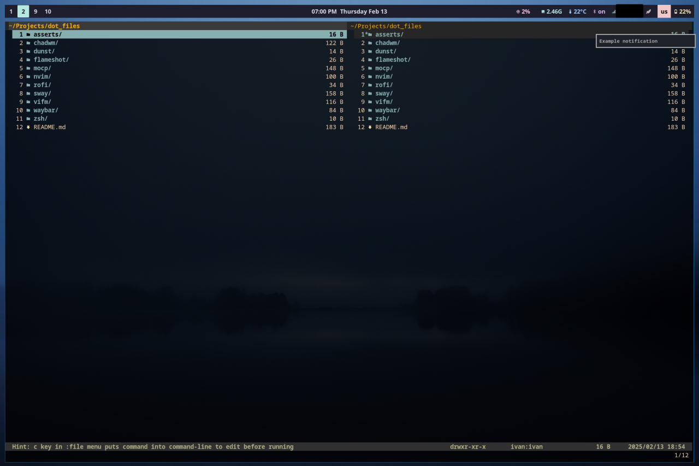

# Dot files



## Packages

| Package | Config path |
|---------|-------------|
| alacritty | `~/.config/alacritty/` |
| dunst | `~/.config/dunst/` |
| flameshot | `~/.config/flameshot/` |
| moc | `~/.moc/` |
| nvim | `~/.config/nvim/` |
| rofi | `~/.config/rofi/` |
| sway | `~/.config/sway/` |
| vifm | `~/.config/vifm/` |
| waybar | `~/.config/waybar/` |
| zsh | `~/.zshrc` |

## Usage

**Prerequisites:** `git`, `stow`

```sh
git clone <repo-url> ~/dotfiles
cd ~/dotfiles
```

If you have existing configs, remove or back them up first:

```sh
rm ~/.config/nvim  # example — repeat for each package you want to stow
```

Then stow all packages:

```sh
make stow
```

Or stow a single package:

```sh
stow -t ~ nvim
```

| Command | Description |
|---------|-------------|
| `make stow` | Symlink all packages into `$HOME` |
| `make unstow` | Remove all symlinks |
| `make restow` | Refresh symlinks (unstow + stow) |
| `make dry-run` | Preview what would be linked without applying |
